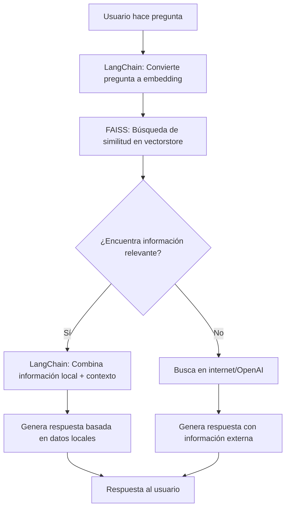

# 🏦 RAG Chatbot con LangChain + FAISS - Sistema de Consultas Inteligentes

Una aplicación web que implementa **RAG (Retrieval-Augmented Generation)** usando **LangChain** y **FAISS** para responder consultas sobre el cuarto retiro de AFP en Perú, combinando búsquedas locales con información específica y respuestas contextuales.

## 🛠️ Tecnologías Principales

Este proyecto utiliza:
- **LangChain**: Framework para construir aplicaciones con modelos de lenguaje
- **FAISS**: Biblioteca de Facebook AI para búsqueda eficiente de similitud en vectores
- **FastAPI**: Framework web moderno para Python
- **React + TypeScript**: Frontend moderno y type-safe
- **HuggingFace Embeddings**: Modelos de embeddings para representación semántica

## 🧠 ¿Qué es RAG y cómo funciona en este proyecto?

### ¿Qué es RAG?
**RAG (Retrieval-Augmented Generation)** es una técnica de inteligencia artificial que combina:
1. **Retrieval (Recuperación)**: Busca información relevante en una base de datos local usando **FAISS** para búsqueda vectorial eficiente
2. **Augmented Generation (Generación Aumentada)**: Usa esa información para generar respuestas más precisas y contextuales con **LangChain**

### ¿Cómo funciona nuestro RAG con LangChain + FAISS?



### Ventajas de nuestro sistema RAG con LangChain + FAISS:
- ✅ **Información específica**: Usa datos oficiales sobre el 4to retiro de AFP en Perú
- ✅ **Búsqueda eficiente con FAISS**: Búsqueda vectorial rápida y escalable
- ✅ **Pipeline con LangChain**: Procesamiento de documentos, embeddings y búsqueda semántica
- ✅ **Respuestas contextuales**: Las respuestas están basadas en información real y actualizada
- ✅ **Búsqueda semántica**: Encuentra información relevante aunque no uses las palabras exactas
- ✅ **Fallback inteligente**: Si no encuentra información local, puede buscar en internet
- ✅ **Sin dependencia de internet**: Funciona principalmente con datos locales

## 📋 Requisitos del Sistema

- **Python 3.8+**
- **Node.js 16+**
- **API Key de OpenAI** (opcional, solo para fallback)
- **8GB RAM mínimo** (para el modelo de embeddings)

## 🛠️ Configuración e Instalación

### 1. Clonar el Repositorio
```bash
git clone <tu-repositorio>
cd ai-chatbot
```

### 2. Configurar el Backend

```bash
# Navegar al directorio del backend
cd backend

# Crear y activar entorno virtual
python3 -m venv venv
source venv/bin/activate  # En Windows: venv\Scripts\activate

# Instalar dependencias
pip install fastapi uvicorn langchain langchain-community langchain-huggingface sentence-transformers faiss-cpu openai python-dotenv
```

### 3. Configurar Variables de Entorno

Crear archivo `.env` en el directorio `backend/`:
```env
OPENAI_API_KEY=tu_api_key_aqui_opcional
HOST=localhost
PORT=8000
```

**⚠️ IMPORTANTE**: El archivo `.env` está en `.gitignore` por seguridad.

### 4. Procesar los Datos (Crear Vectorstore con LangChain + FAISS)

```bash
# Asegúrate de estar en el directorio backend con el venv activado
cd backend
source venv/bin/activate

# Ejecutar el script de ingest para procesar los datos
python ingest.py
```

Este comando:
- Lee el archivo `data/data1.txt` con información sobre el 4to retiro de AFP
- **LangChain**: Divide el texto en chunks usando `RecursiveCharacterTextSplitter`
- **LangChain**: Crea embeddings usando el modelo `sentence-transformers/all-MiniLM-L6-v2` con `HuggingFaceEmbeddings`
- **FAISS**: Crea y guarda el vectorstore en `vector_store/` para búsqueda eficiente

### 5. Configurar el Frontend

```bash
# Navegar al directorio del frontend
cd frontend

# Instalar dependencias
npm install
```

## 🚀 Ejecutar la Aplicación

### Terminal 1: Backend (API)
```bash
cd backend
source venv/bin/activate
uvicorn main:app --reload --host 0.0.0.0 --port 8000
```

### Terminal 2: Frontend (Interfaz Web)
```bash
cd frontend
npm run dev
```

### URLs de Acceso:
- **Frontend**: http://localhost:5173
- **Backend API**: http://localhost:8000
- **Documentación API**: http://localhost:8000/docs

## 🔍 Cómo Funciona la Búsqueda con LangChain + FAISS

### 1. Búsqueda Local (RAG con LangChain + FAISS)
Cuando haces una pregunta, el sistema:
1. **LangChain**: Convierte tu pregunta en un vector usando embeddings (`HuggingFaceEmbeddings`)
2. **FAISS**: Busca en el vectorstore local los documentos más similares usando búsqueda de similitud vectorial
3. **LangChain**: Combina la información encontrada para generar una respuesta contextual

### 2. Fallback a Internet
Si no encuentra información relevante localmente, puede:
- Buscar en internet (si está configurado)
- Usar OpenAI para generar una respuesta general

### Ejemplos de Preguntas que Funcionan Bien:
- "¿Cuándo puedo retirar mi AFP?"
- "¿Qué fechas corresponden a mi DNI que termina en 5?"
- "¿Cuánto dinero puedo retirar?"
- "¿Cómo consulto mi AFP?"
- "¿Cuáles son las fechas del cronograma?"

## 🔧 Estructura del Proyecto

```
ai-chatbot/
├── backend/
│   ├── main.py              # API FastAPI con endpoints RAG
│   ├── ingest.py            # Script para procesar datos y crear vectorstore
│   ├── config.py            # Configuración y variables de entorno
│   ├── data/
│   │   └── data1.txt        # Información sobre 4to retiro AFP Perú
│   ├── vector_store/        # Vectorstore generado (no versionar)
│   │   ├── index.faiss      # Índice FAISS
│   │   └── index.pkl        # Metadatos
│   ├── .env                 # Variables de entorno (no versionado)
│   └── venv/                # Entorno virtual Python
├── frontend/
│   ├── src/
│   │   ├── App.tsx          # Componente principal React
│   │   └── App.css          # Estilos de la aplicación
│   ├── package.json         # Dependencias Node.js
│   └── vite.config.ts       # Configuración Vite
└── README.md                # Este archivo
```

## 🚨 Troubleshooting

### Problema: "Puerto ya en uso"

#### 1. Encontrar qué proceso está usando el puerto:
```bash
# Para puerto 8000 (backend)
lsof -i :8000

# Para puerto 5173 (frontend)
lsof -i :5173

# Ver todos los puertos en uso
netstat -tulpn | grep LISTEN
```

#### 2. Matar procesos específicos:
```bash
# Matar proceso por PID (reemplaza XXXX con el PID real)
kill XXXX

# Matar proceso por puerto (macOS/Linux)
sudo lsof -ti:8000 | xargs kill -9
sudo lsof -ti:5173 | xargs kill -9

# Matar todos los procesos de uvicorn
pkill -f uvicorn

# Matar todos los procesos de node/vite
pkill -f "vite\|node"
```

#### 3. Verificar que los procesos se cerraron:
```bash
# Verificar puerto 8000
lsof -i :8000

# Verificar puerto 5173
lsof -i :5173
```

### Problema: "ModuleNotFoundError: No module named 'langchain_community'"

**Solución:**
```bash
cd backend
source venv/bin/activate
pip install langchain-community
```

### Problema: "Vectorstore no disponible"

**Solución:**
```bash
cd backend
source venv/bin/activate
python ingest.py
```

### Problema: "Error al cargar embeddings"

**Solución:**
```bash
# Reinstalar dependencias de embeddings
pip uninstall sentence-transformers
pip install sentence-transformers
```

### Problema: "LangChainDeprecationWarning: The class HuggingFaceEmbeddings was deprecated"

**Solución:**
```bash
# Instalar el paquete actualizado
pip install -U langchain-huggingface

# El código ya está actualizado para usar:
# from langchain_huggingface import HuggingFaceEmbeddings
# en lugar de:
# from langchain_community.embeddings import HuggingFaceEmbeddings
```

### Problema: "LangChainDeprecationWarning: Importing TextLoader from langchain.document_loaders is deprecated"

**Solución:**
```bash
# El código ya está actualizado para usar:
# from langchain_community.document_loaders import TextLoader
# en lugar de:
# from langchain.document_loaders import TextLoader
```

### Problema: Frontend no se conecta al backend

**Verificar:**
1. Backend está corriendo en puerto 8000
2. Frontend está corriendo en puerto 5173
3. No hay errores de CORS (ya configurado en el backend)
4. Verificar en el navegador: http://localhost:8000 (debe mostrar mensaje de bienvenida)

### Comandos de Diagnóstico Rápido:

```bash
# Verificar que el backend responde
curl http://localhost:8000

# Verificar que el frontend responde
curl http://localhost:5173

# Ver logs del backend
# (Los logs aparecen en la terminal donde ejecutaste uvicorn)

# Ver logs del frontend
# (Los logs aparecen en la terminal donde ejecutaste npm run dev)
```

## 📊 API Endpoints

### `POST /afp-query`
Consulta sobre el 4to retiro de AFP usando RAG local.

**Request:**
```json
{
  "question": "¿Cuándo puedo retirar mi AFP si mi DNI termina en 5?"
}
```

**Response:**
```json
{
  "answer": "Basándome en la información oficial disponible sobre el 4to retiro de AFP en Perú:\n\nSi termina en 5: 5, 6 de noviembre o 27 de noviembre...",
  "question": "¿Cuándo puedo retirar mi AFP si mi DNI termina en 5?",
  "source": "Información local del archivo data1.txt"
}
```

### `GET /search`
Búsqueda directa en el vectorstore.

**Request:**
```
GET /search?query=cronograma%20DNI
```

**Response:**
```json
{
  "results": ["Texto relevante encontrado en los documentos..."]
}
```

## 🎯 Casos de Uso Educativos

Este proyecto es ideal para aprender:

1. **RAG (Retrieval-Augmented Generation)**
2. **LangChain**: Framework completo para aplicaciones con LLMs
   - Document loaders (`TextLoader`)
   - Text splitters (`RecursiveCharacterTextSplitter`)
   - Embeddings (`HuggingFaceEmbeddings`)
   - Vectorstores (`FAISS`)
3. **FAISS**: Búsqueda eficiente de similitud en vectores
4. **Embeddings y búsqueda semántica**
5. **Vectorstores con FAISS**
6. **APIs REST con FastAPI**
7. **Frontend con React y TypeScript**
8. **Procesamiento de texto con LangChain**
9. **Integración de sistemas de IA**

## 🔒 Consideraciones de Seguridad

- ✅ **API Key protegida**: Se almacena en variables de entorno
- ✅ **CORS configurado**: Permite comunicación entre frontend y backend
- ✅ **Validación de entrada**: Se valida la entrada del usuario
- ✅ **Manejo de errores**: Respuestas de error apropiadas
- ✅ **Datos locales**: No envía información sensible a servicios externos

## 📝 Próximas Mejoras

- [ ] Agregar más documentos al vectorstore
- [ ] Implementar búsqueda híbrida (local + internet)
- [ ] Agregar métricas de calidad de respuestas
- [ ] Implementar cache de respuestas
- [ ] Agregar autenticación de usuarios
- [ ] Mejorar la interfaz de usuario

## 🤝 Contribuciones

Las contribuciones son bienvenidas. Por favor:

1. Fork el proyecto
2. Crea una rama para tu feature (`git checkout -b feature/AmazingFeature`)
3. Commit tus cambios (`git commit -m 'Add some AmazingFeature'`)
4. Push a la rama (`git push origin feature/AmazingFeature`)
5. Abre un Pull Request

## 📄 Licencia

Este proyecto está bajo la Licencia MIT. Ver el archivo `LICENSE` para más detalles.

---

**Desarrollado con ❤️ para enseñar RAG y sistemas de IA a estudiantes**

*Este proyecto demuestra cómo implementar un sistema RAG completo con **LangChain** y **FAISS**, desde el procesamiento de datos hasta la interfaz de usuario, usando tecnologías modernas de IA.*